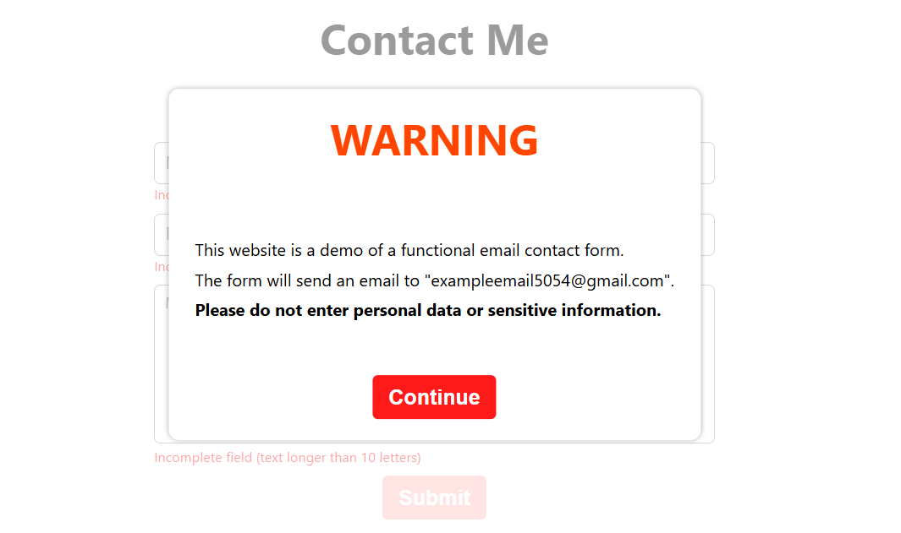
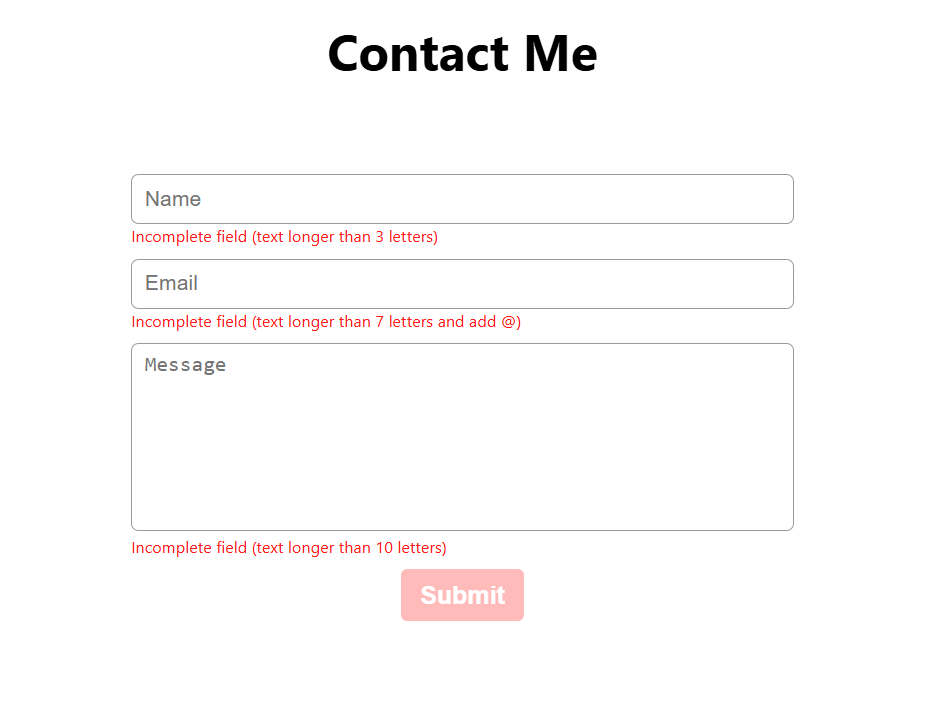

# Formulario para enviar correos de contacto

- Un formulario de contacto que envía un correo.

- Construido con React, Node.js, Express y Nodemailer.

- [Repositorio de la API]()

 Esta página web es una demo de un formulario funcional que envía un email a la cuenta "exampleemail5054@gmail.com".
No introduzca datos personales o información sensible.

